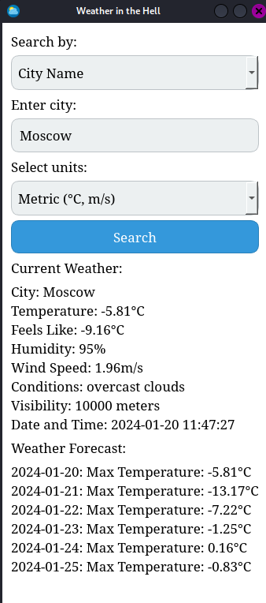

# EN

# Weather App

## Overview

The Weather App is a simple PyQt application that allows users to retrieve current weather information and forecast based on the city name or coordinates.

## Features

- Search weather by City Name or Coordinates (Latitude, Longitude).
- Display current weather information including temperature, feels-like, humidity, wind speed, conditions, visibility, and date/time.
- Show weather forecast with maximum temperature for each day.
- Save location functionality.

## Libraries Used

- PyQt6: The GUI framework for building the application.
- Requests: Used to make HTTP requests to the OpenWeatherMap API.
- Datetime: For handling date and time information.

## How to Run

1. Install the required libraries:

   ```bash
   pip install PyQt6 requests
   ```

2. Execute the Weather App:

   ```bash
   python main.py
   ```

## Usage

1. Launch the Weather App.
2. Choose the search type (City Name or Coordinates).
3. Enter the city name or coordinates accordingly.
4. Select the units for temperature and wind speed.
5. Click the "Search" button to fetch weather information.
6. The app will display the current weather and forecast.

### Note

- For Coordinates: Enter latitude and longitude separated by a comma (e.g., "55.5, 33.3").


## Screenshots



## Author

### BigV

## License

This project is licensed under the [MIT License](LICENSE).

# RU

# Приложение Погоды

## Обзор

Приложение Погоды - это простое приложение на PyQt, которое позволяет пользователям получать текущую информацию о погоде и прогноз на основе названия города или координат.

## Возможности

- Поиск погоды по названию города или координатам (широта, долгота).
- Отображение текущей информации о погоде, включая температуру, ощущается как, влажность, скорость ветра, условия, видимость и дату/время.
- Показ прогноза погоды с максимальной температурой на каждый день.
- Возможность сохранения местоположения.

## Используемые библиотеки

- PyQt6: Фреймворк для создания графического интерфейса приложения.
- Requests: Используется для выполнения HTTP-запросов к API OpenWeatherMap.
- Datetime: Для работы с информацией о дате и времени.

## Как запустить

1. Установите необходимые библиотеки:

   ```bash
   pip install PyQt6 requests
   ```

2. Запустите Приложение Погоды:

   ```bash
   python main.py
   ```

## Использование

1. Запустите Приложение Погоды.
2. Выберите тип поиска (по названию города или по координатам).
3. Введите название города или координаты соответственно.
4. Выберите единицы измерения для температуры и скорости ветра.
5. Нажмите кнопку "Поиск", чтобы получить информацию о погоде.
6. Приложение отобразит текущую погоду и прогноз.

### Примечание

- Для координат: Введите широту и долготу, разделенные запятой (например, "55.5, 33.3").

## Скриншоты


## Автор

### BigV

## Лицензия

Этот проект распространяется под [Лицензией MIT](LICENSE).